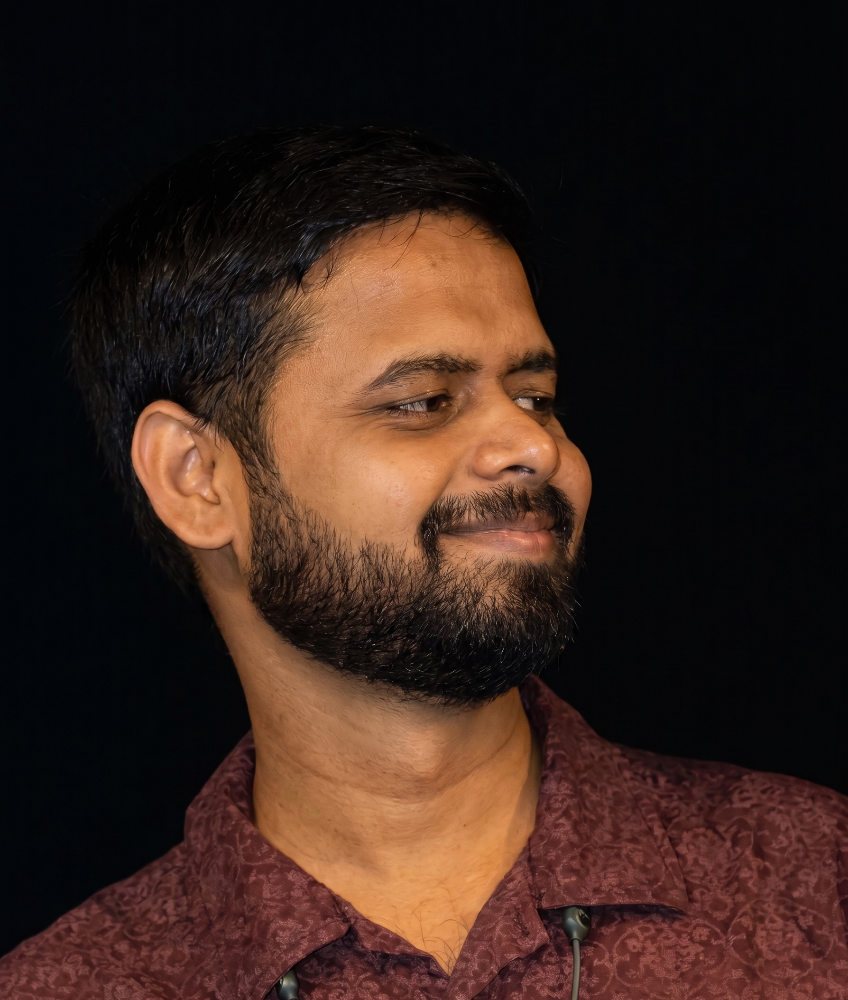

  
  

    <h3>About Me</h3>
    

       I was born in Baidaura Mashrik, a small village in the district of <a href="https://en.wikipedia.org/wiki/Shravasti" target="_blank">Shravasti</a> (श्रावस्ती, the capital of the ancient Indian kingdom of Kosala) in <a href="https://en.wikipedia.org/wiki/Uttar_Pradesh" target="_blank">Uttar Pradesh</a>. I completed my early schooling at Jagat Jeet Inter College in my hometown of Ikauna. I then moved to Allahabad (now Prayagraj) for higher studies and earned my undergraduate degree in Physics, Mathematics, and Computer Science from the University of Allahabad. Following this, I pursued my Master’s degree in Physics at the Indian Institute of Technology (IIT) Guwahati. Currently, I am pursuing my PhD at IUCAA, focusing on gravitational-wave astronomy.
    

    

      Apart from my research, my day-to-day life includes listening to music, watching and (sometimes) playing cricket, and taking photos.  
    

  

