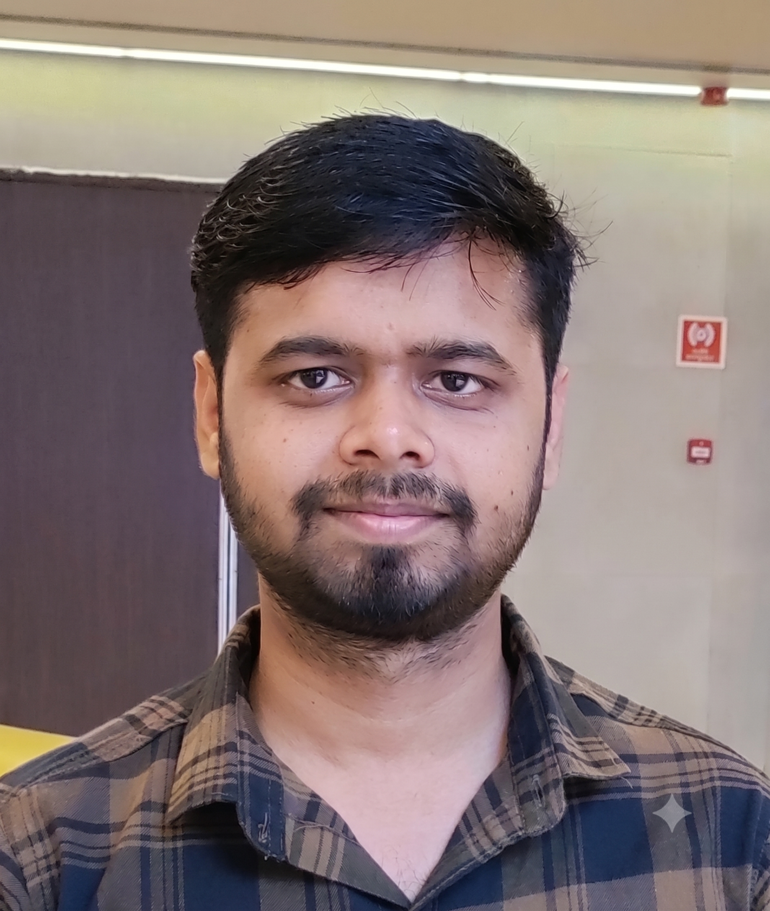

  
  
  

    <h3>Welcome | नमस्ते</h3>
    

      My name is Avinash Tiwari. I am a Ph.D. student at the Inter-University Centre for Astronomy and Astrophysics (<a href="https://www.iucaa.in/en/" target="blank">IUCAA</a>), Pune, where I work with Prof. <a href="https://shasvath-kapadia.github.io/home/" target="_blank">Shasvath J. Kapadia</a>. I work on several aspects of gravitational waves (GWs) emanating from compact binary coalescences (CBCs). Broadly, my research revolves around three main directions: 
    

    <ul>
      <li>Probing the merger environments on a single-event basis.</li>
      <li>Developing model-independent tests to characterize the GW signals.</li>
      <li>Probing the early Universe using GWs and 21-cm cosmology.</li>
    </ul>
    

      For more details about my work, see my <a href="https://avinash-tiwari-at.github.io/research.html" target="_blank">Research</a> page.
    

  

  
  
  
  

